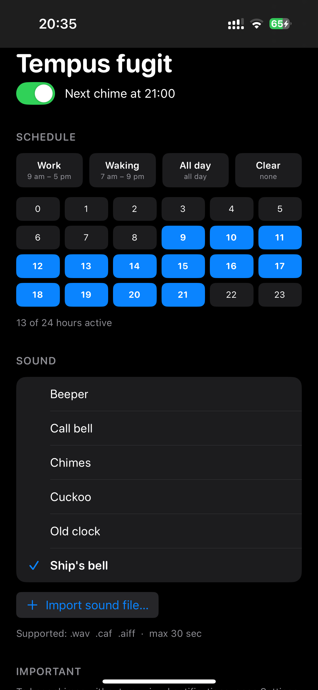

Tempus fugit⏰ - *Latin for "time flies"*
==============

[License: Apache 2.0]
[Platform: iOS 17+]
[Swift: 5.9]

A minimal, elegant hourly chime app for iOS. Choose your hours, pick a sound, and let the time gently mark its passage.

---

Features ✨
----------
- Custom Schedule – Use presets or select exactly which hours of the day (0–24) should trigger a chime.
- Six Built‑in Sounds – Choose from Beeper, Call Bell, Chimes, Cuckoo, Old Clock, and Ship's Bell.
- Import Your Own Sounds – Add your own audio files (.wav, .caf, .aiff).
- Fully Localized – Available in English, Russian, and Turkish.

---

Screenshots 📱
-------------

---

Installation 🚀
--------------

Building from Source
  1. Clone the repository
       git clone https://github.com/esxx/TempusFugit.git
       cd TempusFugit

  2. Open the project in Xcode 26
       open TempusFugit.xcodeproj

  3. Set up signing
       - In Xcode, select the TempusFugit target.
       - Under Signing & Capabilities, choose your development team.
       - Xcode will automatically manage the provisioning profile.

  4. Build and run
       Press Cmd + R or click the Run button.

---

Usage 🧭
-------
1. Launch the app and grant notification permission when prompted.
2. Toggle the chime On using the switch at the top.
3. Tap the hour grid to select the hours you want to hear chimes.
4. Choose a sound from the list – tap it to hear a preview.
5. That's it! The app will schedule local notifications for your selected hours.

Tip: To receive only sound without banners, go to Settings → Notifications → Tempus fugit and disable Banners (keep Sounds enabled).

---

Localization 🌐
--------------
The app is fully localized for:
  - English (en)
  - Russian (ru)
  - Turkish (tr)

If you'd like to contribute a translation for another language, please open a pull request.

---

Permissions 🔒
----------------
Tempus fugit requires only **notification permission** to play hourly chimes.  
It does **not** request access to:
- Camera
- Microphone
- Photos
- Location
- Contacts
- Health data
- Bluetooth

All your preferences (selected hours, chosen sound) are stored **locally on your device** and never leave it.

---

Built With 🛠
------------
- SwiftUI – Modern declarative UI framework.
- UserNotifications – For scheduling and handling local notifications.
- AVFoundation – For audio preview and playback.
- Observation – iOS 17+ reactive state management.

---

License 📄
---------
This project is licensed under the Apache License, Version 2.0.
See the LICENSE file for the full license text.

Copyright 2026 Eldar Shaidullin

Licensed under the Apache License, Version 2.0 (the "License");
you may not use this file except in compliance with the License.
You may obtain a copy of the License at

    http://www.apache.org/licenses/LICENSE-2.0

Unless required by applicable law or agreed to in writing, software
distributed under the License is distributed on an "AS IS" BASIS,
WITHOUT WARRANTIES OR CONDITIONS OF ANY KIND, either express or implied.
See the License for the specific language governing permissions and
limitations under the License.

---

Acknowledgements 🙏
-------------------
- Sound files created/provided by Eldar Shaidullin.
- Icons from SF Symbols.

---

Time flies - use it wisely!
--------------------------

---
